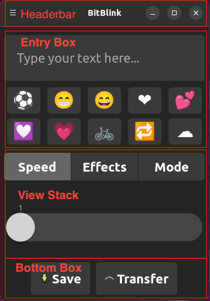
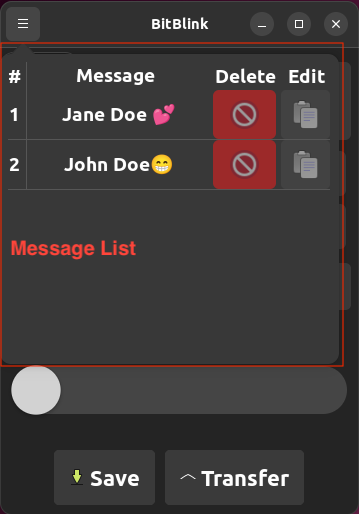

# BitBlink

## Contents

- [Description](#description)
- [Features](#feature-tier-list)
- [Installation Of Dependencies](#installation-of-dependencies)
- [User Interface](#graphical-user-interface-jg)
    - [GTK](#gtk)
    - [Entry Point](#program-entry-point)
    - [GTK Inspector](#gtk-inspector)
    - [Structure](#structure-of-the-ui)
    - [The ```build_ui``` method](#the-buildui-method)
    - [Testing](#testing)
- [Storage](#storage)
    - [JSON Attributes](#json-attributes)
    - [Converting Messages](#converting-messages)
    - [Further Development](#further-development)
- [Bluetooth](#bluetooth)
    - [Build Message](#build-message)
    - [Send Message](#send-message)
- [Packaging](#packaging)
- [Summary](#summary-to-dos)
- [Resources](#resources)

## Description

This Project aims to create a Linux Mobile Application for synchronizing (Fossasia) LED Name Badges with a mobile device 
via Bluetooth(LE).
Archetype is the company's Android App BadgeMagic:
- https://github.com/fossasia/badge-magic-android
- https://github.com/fossasia/badge-magic-ios

BitBlink allows you to send messages containing different emojis, speeds, effects and animations to one or multiple 
bluetooth LED-badges simultaneously. The badges are able to receive up to eight different texts in one message 
(currently the transfer of only one text is implemented). The app lets you choose a variety of different speeds and 
animations for every text (see **Bluetooth** for more information).
You can also decide if you'd like the text to be displayed with a marquee, a flashing and/or an inverted effect.
After creating your message you can send it to the badge using the "Transfer" button. It is also possible to save your 
badges, to use them again later. The loaded badges can be edited further, deleted or send to the badge. You can also 
share your saved badges by simply exporting the .txt files out of the "bitBlinkData" folder and importing them into the 
same folder on the receiving device. BitBlink is compatible with Linux, Linux Mobile and macOS. It works for all devices 
equipped with Bluetooth 4.0 or higher. We can't really tell which badges are compatible with the app as there is a high 
variety of badges on the market. For our tests we used the fossasia led-badge: https://fossasia.com/product/led-badge/
The app could also be compatible with other badges that support Bluetooth and have a height of 11 LEDs per column, but 
this hasn't been tested yet.

**We're always open for new contributors, feel free to contact us via GitHub or submit a pull request** 😊

### Developed with:
- GTK4 (Rust binding Gtk-rs)
- libadwaita as design language
- Bluetooth LE

### Tested on:
- Motorola Moto G4 Play (motorola-harpia) running ```postmarketOS```

### Main components:
- The [**User Interface**](#graphical-user-interface-jg), which interacts with the user
- The [**Storage** component](#storage placeholder), where messages are saved, loaded and deleted 
- The [**Bluetooth** component](#bluetooth placeholder), where the messages are sent to the LED name badge

### Feature tier list:
- [x] Tier 0 (Must Have): Send Text via Bluetooth, Adjust Speed etc., save banners
- [ ] Tier 1: Add predefined images to banner
- [x] Tier 2: Make the App cross-platform: macOS, Windows (limited UI support)
- [ ] Tier 3: Extend functionality to USB
- [ ] Tier 4: Add custom clipart, convert images 
- [ ] Tier 5: Share your banners, UI Improvements (e.g. Animations)

## Installation of dependencies

### Install Rust toolchain

Fundamental for development on this project is the Rust language. For installation of the ```Rustup``` toolchain
visit:

```https://www.rust-lang.org/tools/install``` [last called: ```03.07.2023```]

or just run:

```curl --proto '=https' --tlsv1.2 -sSf https://sh.rustup.rs | sh``` [last called: ```03.07.2023```]

### GTK4 & Libadwaita

#### macOS

On macOS, use ```Homebrew``` for installation of the necessary libraries:

```brew install libadwaita```

As Libadwaita depends on the ```gtk4``` formula, the latter will be installed in combination with ```libadwaita```

#### Windows

#### Ubuntu

On Ubuntu or other related Linux distributions, use ```apt``` for installing ```gtk4``` and ```libadwaita```:

```sudo apt install libgtk-4-1```

```sudo apt install libadwaita-1-dev```

On other Linux distributions, you may have to use ```musl-dev```.

## Graphical User Interface (JG)

### GTK

GTK, short for GIMP-Toolkit, is a cross-platform open-source library for the creation of graphical user interfaces (GUI). 
As of today it is in version ```4.10.4``` (05.06.2023). GTK is written in the C programming language, but several
other
programming languages have bindings to the underlying API, e.g. C++ (gtkmm), Python (PyGTK), JavaScript (Gjs) or, used
in this project, Rust with Gtk-rs. In the following we will talk about Gtk-rs, as the project is written in Rust, but
could possibly be adapted to every other language with GTK binding. Another very convenient feature of GTK since version
3.0 is the possibility to use CSS files, its syntax and most of its keywords for styling the application, which makes
setting e.g.
the font size or setting margins very easy, especially for someone with experience in web development. On top of
GTK, the design language used in this project is Libadwaita, which is the default theme for the GNOME Shell and Phosh.
It comes with its own color palette, icons and typography. Phosh itself is the default graphical shell for several
mobile Linux distributions, e.g. Mobian or postmarketOS, the latter is used in this project.

### Program entry point

The entry point of the application is the instantiation of the ```Application``` object, which is the central object of
a GTK
application, as the name implies. It is the overlying object for all further operations and handles the interaction with
the operating system. A GTK application consists mainly of an application and one or several windows, each containing
multiple widgets. A widget is the basic building block for the GUI, ranging from simple containers for more specialized
widgets (e.g. ```CenterBox```), to different buttons, switches or scales. With that, GTK applications are built in a
modular
fashion, such that widgets can be stacked next or upon each other and, depending on the type, even nested. Widgets are
also highly structured in terms of object-orientation and inheritance. A concept, which pervades the instantiation of
every widget or object, like the application object, is the builder pattern. This design pattern works as follows: Every
object we'd like to instantiate has a corresponding builder object (e.g. ```ApplicationBuilder```
for ```Application```), from
where we concatenate the input parameters for our object, instead of handling them in a constructor. The builder object
collects all the given parameters. After setting all
the necessary parameters, the ```.build()``` function is called on the builder object, which instantiates and returns the
corresponding
object,
e.g. ```Application```. This provides a more "verbal" or "verbose" instantiation of objects and a random order of setting
the parameters.
Once we built our application object, the load_css method is called and the CSS file for the project is connected to a
CSSProvider object, which handles the CSS parsing and connects it to GTK widget styling.
After that we call the ```show_window``` in the closure connected to activating the application, which is given by the
following command to run the application.
In the ```show_window``` method an ```ApplicationWindow``` is created in a separate module. An ```ApplicationWindow```
is a window
subclass, which is connected to the given application and thus can handle calls like quitting the application.
From there we create a Rust ```std::boxed::Box``` (not to be confused with ```gtk::Box```) of
our ```ApplicationWindow```, which is
roughly speaking a pointer with added
functionality. From there we call the ```build_ui``` method, where the building blocks of the UI are created, combined
and
shown. With ```box::leak``` we submit a static reference to the ```ApplicationWindow``` to the method. This function is
used, when
we intend to keep the data for the remaining lifetime of the program, which applies to our ```ApplicationWindow``` and
enables
updating the content the ```ApplicationWindow``` is supposed to show instead of creating a new,
updated ```ApplicationWindow```, as
GTK has no dedicated refresh or update method, which calls a corresponding ```build_ui``` or ```update_ui``` method
again (at
least based on the knowledge of the authors and GTK version at the time of writing this documentation).

### GTK Inspector

A convenient way to inspect the structure and styling of a GTK application is by using the built-in ```GTK Inspector```.
It offers the possibility to view the structure of the widgets, their content, properties, state, CSS classes etc. in a
manner similar to
inspecting websites and their HTML via the browser. Another great feature is the ability to directly type CSS and see
the
impact without having to re-build the whole application. The GTK inspector can bei called directly while having launched
the application with the keyboard shortcut ```CTRL + SHIFT + D``` (or ```CTRL + SHIFT + I``` to automatically select the
widget under the mouse pointer).

### Structure of the UI

The user interface consists of two main parts and is inspired by the BadgeMagic Android App. The concept of the UI at the
time of submitting the project is as follows: On top we have a menu bar with the title of the application and a menu button.
On desktop devices we also have the standard buttons for hide, full screen and quit on the right side of the menu bar.
When clicking the menu button a popover window with the list of saved messages is shown.
Every list entry has its own button for deleting the message or loading it into the editor, the second part of the UI.
The message list has to loosely communicate with the editor, as we have to update the list when we save or delete a
message, and we have to fill the editor with the data from the messages, when we press a ```Edit``` button.
In the editor part we have an input field on top, where the user can type in the text he or she wants to be displayed,
additionally, in the following grid the user can choose between ten different icons, which are added to the text message
as unicode emojis.
Followed by the entry section we have three buttons, with which the user can switch between three pages, one with a
scale for adjusting the speed of the message (```Speed```), one for toggling the invert, marquee and flash functionality
of
the badge (```Effects```) and one for setting the animation mode of the message (```Animations```). This is done by a
GTK ```ViewStack```.
At the bottom of the ```ApplicationWindow``` we have two buttons, one for saving the current, configured message and one
for
calling the Bluetooth functionality and thus sending the message to the LED badge.

### The build_ui method

The ```build_ui``` method is the central block of creating and managing the GUI. Here we create the different parts of
the UI
previously described and append them to the central "```content```" ```gtk::Box```-Widget, which adds them to the end of
the content
in
the orientation specified with the construction of the content object, here vertically. The different parts of the editor
component have their own method for creation, which return ```boxed::Box```-References again. On the one hand, they
return the
complete widget, which is appended to a ```gtk::Box```, which combines all these widgets before appending
them to ```content```. On the other hand, these methods return the input widget of these sections, e.g. the entry field.
The
reason for that is, we have to get and set the values of these widgets dynamically as well as connecting click
events to the buttons, and that is best done directly
on the reference of the widget, without the extra route of looking for the corresponding input widget in the parent
widget. After we built our ```HeaderBar```, ```Entry```, Icon ```Grid```, ```ViewStack``` and buttons at the bottom of
the window, we connect
the buttons with the click event performed on them. This is done with passing a closure to the ```connect_clicked```
-method. For the input widgets we again create static references, because we want to keep their data as well as the
reference
"alive" as long as the program is running.
In the case of the Save-button we first set the button insensitive to prevent several clicks on the button while
performing
the save operation. Then we create the message from our input widget values and pass it to the storage object in the
```save_message```-method. Then we call the ```build_ui``` method again, which then refreshes the content we set in our
window as well
as the click callbacks to the relevant buttons. We also have the possibility to keep the state of the input with the
Option
parameters of the method. With that, we update the message list and display the newly saved message in the list.
We do the same for every delete button in the message list except for the precedent action, which is deleting the
message.
For the ```Transfer``` button we again set the button insensitive, build the message and pass it to the bluetooth module
to send the message
to the badge. A special characteristic here is the usage of MainContext and its function ```spawn_local```. With that,
we
create a separate thread for sending the message, because we need to operate asynchronously, a condition set by the
Bluetooth functionality. We also use the ```clone!```
macro, which creates strong references to the input widgets as well as the ```Transfer``` button. Here we don't have to
refresh the UI. Events such as clicking a button and their connected callbacks are handled by the
GTK ```Main Event Loop```, which operates on a single thread by default, and we don't want to block this thread while
waiting for the connection to be established and sending the message. Here, setting the ```Transfer``` button also
prevents
creating several threads when clicking the ```Transfer``` button repeatedly.






### Testing

A cargo crate for testing Gtk-rs applications does exist, but could not be imported and embedded into the project at this
point of development. Neither ```macOS``` nor ```Ubuntu``` resolve the ```Cargo.toml``` imports used in the introductory
example of the ```gtk-test``` repository. Therefore, more than manual testing of the user interface was not possible in the given time scope,
but has to be picked up later on. The basic structure of the imports are given as comments in the ```Cargo.toml``` file.

```https://github.com/gtk-rs/gtk-test``` [last called: ```03.07.2023```]

## Packaging (JG)

At this point of development we're able to build a basic Alpine Linux Package (APK) via pmbootstrap, a command line tool
for
Linux, which aims at streamlining processes involved in using and developing for postmarketOS. This package can then be
transfered to the phone and executed via the terminal. In the future, the BitBlink application should be displayed like
a regular App like 'Karlender'. This can probably be done via an ```.desktop``` file or a ```flatpak```, but needs
further
effort and was not possible in the given time scope.
The following instructions reflect the current state of knowledge of the author, so other, more suitable paths could be
possible. The instructions are written using Ubuntu as host PC system. 
Building a basic Alpine Linux Package needs a ```APKBUILD``` file, which sets the parameters of the package, such as
the package version, the URL to the remote repository and the shell commands necessary for building the executable. In
the case of this project or Rust project in general, one would call ```cargo build --release``` (or other similar
parameters)
in the ```build()``` block of the ```APKBUILD``` file. A new package template can be created via the terminal command

```pmbootstrap newapkbuild *URL to the remote repository*```

Then the ```APKBUILD``` file has to be configured accordingly. The file usually sits
in ```~/.local/var/pmbootstrap/cache_git/pmaports/main/*project name*/```
but the path to the file copies can be inspected with ```pmbootstrap config aports```. After setting up the build file,
the package can be built with:

```pmbootstrap build *project name*```

Optionally, the ```--src=*path*``` can be set for using local project files instead of downloading the repository from
the source URL specified in the ```APKBUILD``` file.
After changing the ```APKBUILD``` file, the checksum of the file should be updated, which can be done
with: 

```pmbootstrap checksum *package name*```

Possible errors in the checksum or build process can be further investigated by calling:

```pmbootstrap log```

To transfer the built package to a phone running postmarketOS via USB, first a SSH connection has to be set up. On the phone
you have to call:

```sudo service sshd start```

The PC connected to the phone has to establish the connection by starting a DHCP server:

```sudo dhclient usb0```

The phone should then be accessible at the IP address ```172.16.42.1```. Once the PC is connected to the phone, the package 
can be transfered to the phone via:

```pmbootstrap sideload --host 172.16.42.1 --user user --arch *phone architecture*  *package name*```

When successful, the package can then be opened on the phone via the terminal, calling the package name.


## Storage (LK & NG)
The saved badge configurations are stored as .txt-Files in the JSON-format (using the serde framework) in a folder called "bitBlinkData" inside the current
working directory of the application. The storage of the files is handled using a very simple struct called "Storage". 
Before using this struct is has to be initialized using the "build_storage()"-Function, which creates the storage directory. 

### JSON attributes

**file_name** --> name of the .json file. It is automatically generated using the timestamp from of the current time from
the chrono crate\
**hex_strings** --> a list of the strings that are to be displayed on the badge. The texts are encoded as hex 
strings in order to be compatible with the saved badges of the "Badge Magic" android app. The badge is able to
receive up to 8 separate strings in a single bluetooth transfer. The frontend currently only allows for sending
a single string however the entire backend supports the transfer of multiple strings in one transfer to make 
further development easier. \
**inverted** --> a boolean list that determines if the corresponding string in the "hex_string" list is supposed to
be inverted when displayed on the badge. \
**flash** --> a boolean list that determines if the corresponding string in the "hex_string" list is supposed to
flash when displayed on the badge. \
**marquee** --> a boolean list that determines if the corresponding string in the "hex_string" list is supposed to
have the marquee-border when displayed on the badge. \
**speed** --> a list of strings that determines the speed of the corresponding string in the "hex_string" list when 
displayed on the badge. \
**mode** --> a list of strings that determines the animation of the corresponding string in the "hex_string" list
when displayed on the badge. 


### Converting Messages
The bluetooth message consists of multiple lines of hexadecimal strings with each line having a length of 32 digits. Every 
two hexadecimal digits define the configuration (on or off) of eight LED-Pixels in the badge display (for more information regarding 
the exact structure of the bluetooth message see **Bluetooth**). In order to convert each letter of the input text into this 
kind of configuration, every letter of the input text is mapped onto a 22 digits long string describing the corresponding pixel configuration. 
The only exception to this are the emojis or "keywords" as they are referred to in the code. Since these emojis can take 
up more space on the badge than a single letter they can have any length that is a multiplcity of 22. 
Adding new symbols or letters into the pool of already available ones is therefore fairly easy. 

### Further Development
The "utils.rs" file contains all kinds of methods for handling the creation of new messages as well their en- 
and decoding into the proper badge-compatible hex-string format. \
It also contains the "build_single_message_from_first_text_vec_of_given_messages" function which remains unused
as of now due to the time constrains of the project. \
The purpose of this function was to enable the transfer of multiple message strings as mentioned above. The 
idea was to choose a selection of message-texts from the list of all messages (i.e. by using a checkbox) in 
the frontend and then combining all those messages into a single message and sending it to the badge. The only 
component still missing for this feature is the ability to check the messages in the list of all messages.

## Bluetooth (LK & NG)
The Bluetooth connection to the badge is established with **btleplug** (version 0.10.5). Btleplug is a Bluetooth Low 
Energy (**BLE**) module library for rust. BLE is completely separated to classic Bluetooth and therefore  not compatible 
to it. It is integrated in Bluetooth 4.0. Because of the advantages in power consumption it is used in the badges.
Btleplug supports a variety of operating systems like Windows 10, macOS and Linux, which is why we decided to use it. 
At the current state BitBlink only supports **Linux** and **Linux Mobile**, but could be expanded for other 
operating systems. It also works for **macOS**, but some features won't be rendered perfectly.

### Build Message
The messages which are sent to the badge follow a persistent **structure**. Every message can hold different texts. 
Every text has different settings. You can decide for every text if you want the bits to be inverted, flashing or if 
they should have a marquee. Also, you can choose a speed (0 – 7) and a mode (0 -  8) for every text. You can have up to 
8 different texts with settings in every message and the badge will always only show one message.

After deciding what the badge should show on it, the actual message which will be sent via Bluetooth is built. To do 
that we add together the information from above in the right structure. First we will build it together as a simple 
string that consist of hexadecimal code that contains the data as bytes. So two hexadecimal figures will be one byte.

Every Bluetooth message to the badge starts with the **package header** “77616E670000”. With that the badge knows what 
to do with the following data that is sent to it.

The next one byte (corresponding to the next two hexadecimal figures) consists of the data if the texts should be 
**flashing**. As mentioned above we can decide that for every text separately. If we want the first text to be flashing, 
we simply switch the standard “00” to “01”. If we want only the second one to be flashing, we change the standard “00” 
to “02”. For the third one we change the “00” to “04”. If we want the first three to be flashing, we just add all three 
together to “07”. If we want all 8 texts to be flashing, we get “FF” which is equal to the decimal number “255”.

The next two hexadecimal figures contain the data for the **marquee**. It works exactly the same as the flash.

Next, we can choose which **speed** and **mode** we want to use. Every text has one hexadecimal number to decide which 
speed we want to use for it. There are 8 different speeds from speed 1 which corresponds to “0” till speed 8 which 
corresponds to “7”.

Every text has one hexadecimal number to decide which mode we want to use for it. There are 9 different modes (0 - 8):\
•	0 --> leftToRight\
•	1 --> rightToLeft\
•	2 --> upToDown\
•	3 --> downToUp\
•	4 --> FixedMiddle\
•	5 --> FixedLeft\
•	6 --> picture animation\
•	7 --> curtain animation\
•	8 --> laser animation\
The hexadecimal number for the speed and for the mode are put together one by one for all eight messages. For empty 
texts we just use “00” for the speed and mode. The same applies to every other place which is used for more texts than 
we need. Now we got the first 32 hexadecimal numbers.

The next 32 are used to tell the badge the **length** of the different texts. The first size is indicated by the first 
four hexadecimal figures and the second size uses the second four and so on. Four hexadecimal numbers used together can 
hold a decimal number as high as 164. Therefore, a single text can have 65.535 digits.

The next 32 hexadecimal figures are used for a **timestamp** which can be used by the app or the badge to track errors 
and to track which messages have been sent most recently. The structure of it begins with twelve zeros. After that we 
will add the last two digits of the year, followed by the month, the day, the hour, the minute and the second each with 
two digits. And after that we fill the rest with another 8 zeros.

After that we have 32 zeros digits which are used as a **separator** between the settings of the texts and the 
actual **texts**. Here every letter consists of 88 bits. Every bit shows if the belonging light of the badge is turned 
on or off. For example, here are the 88 bits of the letter “A”:\
00000000\
00111000\
01101100\
11000110\
11111110\
11000110\
11000110\
11000110\
11000110\
11000110\
00000000

One letter is eight in length and eleven in height. We than translate the 88 bits to 22 hexadecimal numbers. After we 
have done that for all 8 texts, we need to make sure that the whole strings' length modulo 32 is zero. If that isn’t the 
case we add the amount of the missing length as zeros to the end of the string.

Lastly, we will separate the whole string after every 32 hexadecimal figures and convert those 32 hexadecimal digits to 
a vector with the datatype u8.

### Send message
As mentioned above we use btleplug for sending the message.
Firstly, we connect to the devices Bluetooth adapter. With this we can scan for devices. To find the badge the system 
has a look at the names. If the name contains “LSLED” it should be the badge we are looking for. After we found a badge, 
we try to connect it. Then we discover the services of the badge. The badge has several services which are identified 
by the characteristic uuids for different actions like the system version of the badge, the battery level and the one 
we are looking for the service "write". We use this one to write the message to the badge. For that we send 32 
hexadecimal figures per write request as a vector with the datatype u8 (bytes) to the badge. After we have done this for 
the whole message, we disconnect the badge. With that the sending process is finished and the badge should show the new 
message on the display.

## Summary and TO-DOs

The project kickoff has been quite troublesome because of missing dependencies for the User Interface, which put quite a big delay on the
development process. It hasn't been clear, which libraries had to be installed on the system, e.g. with ```Homebrew```,
and which had to be imported via ```Cargo```. This has been amplified by the fact, that the project team is working
on different host operating systems. Luckily, the GTK project made huge improvements in supporting macOS with version ```4.0.0```,
and using an Ubuntu virtual machine made the development process easier, and by the time of submission, the application
could even be compiled and used in Windows with the help of the commands found in the [Installation](#installation-of-dependencies) section.
While there are still a lot of [features](#feature-tier-list) left to be covered, which can be found in comparable (Closed-Source) Android
or iOS apps, we were able to implement all the core features necessary to have a functioning application for programming
(Fossasia) LED name badges with Linux (Mobile) devices via Bluetooth. On top of that, we have shown, that we can build
a cross-plattform application without re-writing any OS-specific, thanks to the great cross-plattform capabilities
of the Open-Source projects ```GTK4``` and ```btle-plug```. Nevertheless, there are several tasks to be tackled. These are apart from
the additional features:

- [ ] Improve Packaging (e.g. with Flatpak)
- [ ] Display as „real“ App with Icon - An Icon mockup ```GIMP``` file as well as a PNG is already included in the repository
- [ ] Share on https://linuxphoneapps.org

In conclusion, the "BadgeMagic for LinuxMobile" was a success and the goals set by the supervisor have been reached,
but there's still a lot of room for further development. We welcome everyone to participate.

## Resources
- https://specifications.freedesktop.org/icon-naming-spec/icon-naming-spec-latest.html
- https://gtk-rs.org/gtk4-rs/stable/latest/book/
- https://github.com/Taiko2k/GTK4PythonTutorial/blob/main/README.md (Written in Python, may be useful nevertheless)
- https://github.com/gtk-rs/gtk4-rs/tree/master/examples
- https://docs.gtk.org/gtk4/visual_index.html
- https://linuxphoneapps.org/frameworks/libadwaita/
- https://world.pages.gitlab.gnome.org/Rust/libadwaita-rs/
- https://docs.rs/libadwaita/0.4.1/libadwaita/index.html
- https://gnome.pages.gitlab.gnome.org/libadwaita/doc/1-latest/
- https://blog.devgenius.io/initial-setup-for-a-gtk4-app-with-libadwaita-in-rust-using-vscode-b6f8c127a75e
- https://github.com/deviceplug/btleplug
- http://nilhcem.com/iot/reverse-engineering-bluetooth-led-name-badge
- https://linmob.net/pinephone-setup-scaling-in-phosh/
- https://blog.orhun.dev/alpine-packaging-setup/

